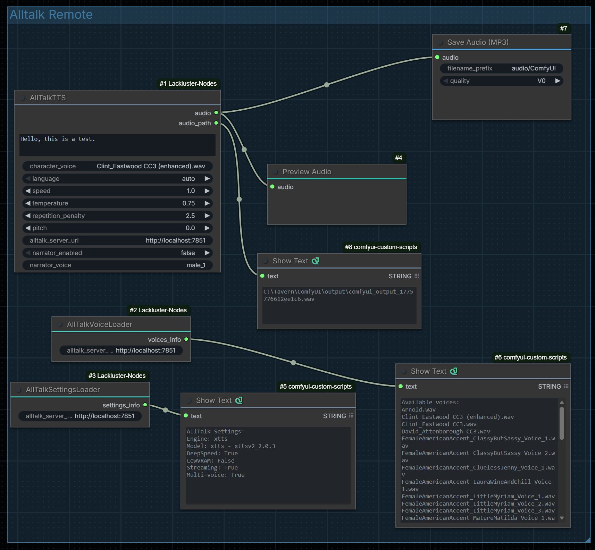

# ComfyUI-Lackluster-Nodes



Custom ComfyUI nodes for AllTalk TTS integration.

## Features

- **AllTalk TTS Generator**: Generate text-to-speech audio using an existing AllTalk installation
- **AllTalk Voice Loader**: Load and view available voices from AllTalk server
- **AllTalk Settings Loader**: View current AllTalk server settings

## Installation

### Method 1: Using ComfyUI Manager
1. Open ComfyUI Manager
2. Search for "ComfyUI Lackluster Nodes"
3. Click Install
4. Restart ComfyUI

### Method 2: Manual Installation
1. Clone this repository into your ComfyUI custom nodes directory:
   ```bash
   cd path/to/ComfyUI/custom_nodes
   git clone https://github.com/yourusername/ComfyUI-Lackluster-Nodes.git
   ```
2. Install dependencies:
   ```bash
   cd ComfyUI-Lackluster-Nodes
   pip install -r requirements.txt
   ```
3. Restart ComfyUI

## Prerequisites

**This node requires an AllTalk TTS server installation.** You must install and set up AllTalk before using these nodes.

### Installing AllTalk

AllTalk can be installed using two methods:

#### Method 1: Using atsetup.bat (Recommended for Windows)

1. Clone AllTalk and switch to the betav2 branch:
   ```bash
   git clone -b betav2 https://github.com/erew123/alltalk_tts.git
   ```
2. Navigate to the AllTalk directory:
   ```bash
   cd alltalk_tts
   ```
3. Run `atsetup.bat` to set up the environment
4. Follow the installation prompts
5. Start the AllTalk server

#### Method 2: Using uv (Alternative)

If you prefer using [uv](https://github.com/astral-sh/uv) (a fast Python package installer):

1. Install uv if you haven't already:
   ```bash
   pip install uv
   ```

2. Clone AllTalk on the betav2 branch:
   ```bash
   git clone -b betav2 https://github.com/erew123/alltalk_tts.git
   cd alltalk_tts
   ```

3. Create a virtual environment and install dependencies:
   ```bash
   uv venv
   .venv\Scripts\activate  # On Windows
   uv pip install -r .\system\requirements\requirements_standalone.txt
   ```

4. Start the AllTalk server:
   ```bash
   python script.py
   ```

5. Verify the server is running by visiting `http://localhost:7851/api/ready` in your browser

---

Once AllTalk is running, these nodes will connect to it via the server URL (default: `http://localhost:7851`).

## Usage

### AllTalk TTS Generator

The main node for generating text-to-speech audio.

**Inputs:**
- `text`: The text to convert to speech
- `character_voice`: The voice character to use (e.g., "female_1")
- `language`: Language code (auto, en, es, fr, de, it, pt, nl, ru, ja, zh, ko)
- `speed`: Speech speed (0.25 - 2.0)
- `temperature`: Generation temperature (0.1 - 1.0)
- `repetition_penalty`: Repetition penalty (1.0 - 20.0)
- `pitch`: Voice pitch (-10.0 - 10.0)
- `alltalk_server_url`: URL to your AllTalk server (default: http://localhost:7851)
- `narrator_enabled`: Enable narrator (false, true, silent)
- `narrator_voice`: Narrator voice character (default: male_1)

**Outputs:**
- `audio`: Audio data for use in other nodes
- `audio_path`: File path to the generated audio

### AllTalk Voice Loader

Fetches and displays available voices from your AllTalk server.

### AllTalk Settings Loader

Displays current settings from your AllTalk server.

## Node Location

All nodes can be found in the ComfyUI menu under: `audio/tts`

## Troubleshooting

### Cannot connect to AllTalk server
- Ensure AllTalk is running and accessible at the specified URL
- Check that the URL in the node matches your AllTalk server URL
- Default URL is `http://localhost:7851`

### No voices available
- Make sure AllTalk has voices configured
- Use the AllTalk Voice Loader to see available voices

## License

MIT
