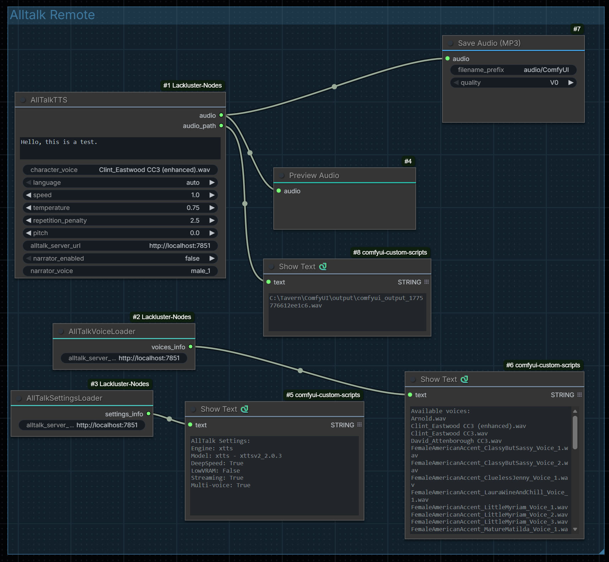

# ComfyUI-Lackluster-Nodes



A collection of custom ComfyUI nodes spanning TTS, camera control, prompt generation, and workflow utilities.

---

## 📦 Installation

### Method 1: Using ComfyUI Manager
1. Open ComfyUI Manager
2. Search for "ComfyUI Lackluster Nodes"
3. Click Install
4. Restart ComfyUI

### Method 2: Manual Installation
```bash
cd path/to/ComfyUI/custom_nodes
git clone https://github.com/LacklusterOpsec/ComfyUI-Lackluster-Nodes.git
cd ComfyUI-Lackluster-Nodes
pip install -r requirements.txt
```
Restart ComfyUI after installation.

---

## 🗂️ Node Categories

| Category | Nodes |
|---|---|
| `Lackluster/Camera` | CamOrbit, CamOrbit Sequence, CamOrbit Translate, Lackluster-Camera, Lackluster-Camera Sequence, Lackluster-Camera Translate, Lackluster-Shot Queue, Lackluster-Shot Queue V2 |
| `Lackluster/Prompt` | Lackluster Prompt Enhancer |
| `Lackluster/Audio/Trap` | Trap Prompt Generator, Trap Prompt Generator v2, Trap Style Selector |
| `Lackluster/Text` | Text Multiline, Show Text |
| `Lackluster/Video` | First/Last Frame Selector |
| `Lackluster/System` | Pip/UV Outdated Packages |
| `audio/tts` | AllTalk TTS Generator, AllTalk Voice Loader, AllTalk Settings Loader |

---

## 🎥 Camera Nodes

### CamOrbit (`lackluster_cam_orbit.py`)
> Category: `Lackluster/Camera`

A single-shot camera angle picker with built-in named presets and an optional 3D scene preview.

**Inputs:**
- `preset` — Named angle preset (e.g. "Front (eye-level)", "Right Profile", "Overhead", "Worm's-eye", etc.)
- `azimuth` — Horizontal rotation 0–360°
- `elevation` — Vertical tilt -30° to 60°
- `distance` — Camera distance (0 = wide, 10 = close-up)
- `prefix` — Token prepended to the prompt (e.g. `<sks>`)
- `extra_prompt` — Extra text appended after the generated prompt
- `camera_view` — Toggle 3D preview widget
- `image` *(optional)* — Image to display in the 3D scene

**Outputs:** `prompt` (STRING), `label` (STRING), `camera_info` (LOAD_3D_CAMERA)

---

### CamOrbit Sequence (`lackluster_cam_orbit.py`)
> Category: `Lackluster/Camera`

Batch camera angle sequence builder. Accepts angles via JSON, CSV, or auto-sweep and emits a list of prompts for sequential generation.

**Modes:**
- `json_sequence` — Array of `{azimuth, elevation, distance, label?, extra?, prefix?}` objects
- `csv_sequence` — CSV with columns `label,azimuth,elevation,distance[,extra]`
- `auto_sweep` — Linearly interpolate between `sweep_start` and `sweep_end` over `sweep_steps`

**Outputs:** `prompts` (STRING list), `prompt_text` (STRING), `labels_text` (STRING), `count` (INT), `camera_info` (LOAD_3D_CAMERA list)

---

### CamOrbit Translate (`lackluster_cam_orbit.py`)
> Category: `Lackluster/Camera`

Translates the English camera/shot terms in a prompt (e.g. "front view", "close-up") into Chinese, Japanese, or Korean using a built-in glossary.

**Inputs:** `prompt` (STRING), `target_language` (中文 / 日本語 / 한국어 / English)

**Outputs:** `prompt` (STRING)

---

### Lackluster-Camera (`lackluster_qwen_multiangle.py`)
> Category: `Lackluster/Camera`

Single 3D camera angle control node. Outputs a formatted angle prompt and `LOAD_3D_CAMERA` metadata for multi-angle generation pipelines.

**Inputs:** `horizontal_angle`, `vertical_angle`, `zoom`, `default_prompts`, `camera_view`, `image` *(optional)*

**Outputs:** `prompt` (STRING), `camera_info` (LOAD_3D_CAMERA)

---

### Lackluster-Camera Sequence (`lackluster_qwen_multiangle.py`)
> Category: `Lackluster/Camera`

Queue multiple camera angles via an interactive list and batch-process them sequentially. Supports two output modes:
- `sequential_batch` — Emits a list triggering one ComfyUI execution per angle
- `multiline_text` — Concatenates all prompts into a single multiline string

**Outputs:** `prompts` (STRING list), `prompt_text` (STRING), `camera_info` (LOAD_3D_CAMERA list), `sequence_count` (INT)

---

### Lackluster-Camera Translate (`lackluster_qwen_multiangle.py`)
> Category: `Lackluster/Camera`

Translates camera/shot terminology in prompts to a target language via a maintained glossary. Supports Chinese, Japanese, and Korean.

**Inputs:** `prompt` (STRING), `target_language`

**Outputs:** `prompt` (STRING)

---

### Lackluster-Shot Queue (`lackluster_shot_queue.py`)
> Category: `Lackluster/Camera`

Interactive 3D camera widget for selecting angles and queuing up to 10 shots, then running ComfyUI to execute each shot sequentially.

**Inputs:** `horizontal_angle`, `vertical_angle`, `zoom`, `camera_view`, `custom_prefix`, `sequence_json` *(optional)*, `image` *(optional)*

**Outputs:** `prompts` (STRING list), `prompt_text` (STRING), `camera_info` (LOAD_3D_CAMERA list), `queue_count` (INT)

---

### Lackluster-Shot Queue V2 (`lackluster_shot_queue_v2.py`)
> Category: `Lackluster/Camera`

Preset-based camera shot queue. Select from 15 named presets (Front Close-Up, Low Angle Hero, Dutch Angle, Aerial Shot, etc.), add them to a queue (max 10), and execute them sequentially.

**Presets include:** Front Close-Up, Front Medium, Front Wide, Low Angle Hero, Low Angle Close-Up, High Angle, Over Shoulder, Right/Left Profile, Back View, Three-Quarter Front, Dutch Angle, Aerial, Extreme Close-Up, Cowboy Shot

**Inputs:** `camera_preset`, `add_to_queue`, `run_queue`, `clear_queue`, `custom_prefix`, `sequence_json` *(optional)*

**Outputs:** `prompts` (STRING list), `prompt_text` (STRING), `camera_info` (LOAD_3D_CAMERA list), `queue_count` (INT)

---

## ✨ Prompt Enhancement

### Lackluster Prompt Enhancer (`lackluster_prompt_enhancer.py`)
> Category: `Lackluster/Prompt`

Rewrites short prompts into detailed generation/editing prompts using an LLM (Ollama or any OpenAI-compatible endpoint). Uses task-specific templates based on Bernini's official per-task prompt engineering.

**Task Types:**
| Code | Description |
|---|---|
| `v2v` | Video-to-Video editing |
| `rv2v` | Reference-image guided video editing |
| `r2v` | Subject-driven video generation |
| `t2v` | Text-to-Video generation |
| `t2i` | Text-to-Image generation |
| `r2i` | Subject-driven image generation |
| `i2i` | Image-to-Image editing |
| `i2v` | Image-to-Video generation |
| `mv2v` | Multi-reference video editing |
| `vi2v` | Video content propagation |
| `ads2v` | Ad insertion in video |
| `vrc2v` | Video with reference camera/action control |

**Inputs:**
- `prompt` — Raw instruction
- `task_type` — Enhancement template to use
- `ollama_url` — LLM endpoint (default: `http://127.0.0.1:11434`)
- `ollama_model` — Model name (leave empty to pass through without enhancement)
- `api_format` — `Ollama` or `OpenAI / vLLM`
- `auto_enhance` — Enhance on every queue run
- `image0`–`image4` *(optional)* — Reference images sent to multimodal LLMs
- `text_input` *(optional)* — Text connection input (overrides the prompt field when connected)
- `negative_prompt` *(optional)* — Custom negative prompt
- `temperature`, `max_tokens`, `seed` — LLM generation parameters
- `prepend_system_prompt` — Prepend the task system prompt to output
- `unload_ollama` — Unload model from VRAM after enhancement

**Outputs:** `enhanced_prompt` (STRING), `negative_prompt` (STRING)

---

## 🎵 Trap Music Prompt Nodes

### Trap Prompt Generator (`trap_prompt_generator.py`)
> Category: `Lackluster/Audio/Trap`

Generates structured trap music production prompts from 10 musical categories. Each category can be set manually or randomised with a seed for reproducibility.

**Categories:** genre, BPM, energy, bass, drums, rhythm, melody, vocals, atmosphere, mix

**Inputs:** `seed`, plus one dropdown per category (each with a 🎲 Random option)

**Outputs:** `prompt` (STRING) — comma-separated tag list

---

### Trap Prompt Generator v2 (`trap_prompt_generator2.py`)
> Category: `Lackluster/Audio/Trap`

Enhanced version with 14 musical categories, expanded option pools, three output formats, optional category exclusion, and custom tag injection.

**Additional categories over v1:** key, mood, fx, arrangement

**Output Formats:**
- `tags` — Comma-separated list
- `natural` — Flowing natural-language sentence
- `structured` — `[label] value` token format

**Inputs:** `seed`, `prompt_style`, one dropdown per category (each with 🎲 Random and — None — options), `custom_tags` *(optional)*

**Outputs:** `prompt` (STRING)

---

### Trap Style Selector (`trap_style_selector.py`)
> Category: `Lackluster/Audio/Trap`

Selects a pre-written description from a library of 50+ named trap subgenre styles. Each style includes characteristic instrumentation and a scene/atmosphere descriptor.

**Example styles:** Dark Trap, Memphis Phonk, Witch House Trap, Rage Trap, Drift Phonk, UK Drill Trap, Trap Soul, Gospel Trap, Doom Phonk, Circus Trap, and many more.

**Inputs:** `trap_style` — Dropdown of all available styles

**Outputs:** `text` (STRING) — Formatted style description

---

## 📝 Text Nodes

### Text Multiline (`text_multiline.py`)
> Category: `Lackluster/Text`

A simple multiline text input node with dynamic prompt support. Displays the current text value in the node UI.

**Inputs:** `text` (multiline STRING with dynamicPrompts enabled)

**Outputs:** `text` (STRING)

---

### Show Text (`text_multiline.py`)
> Category: `Lackluster/Text`

Displays connected text output directly on the node widget. Useful for previewing prompt strings mid-workflow.

**Inputs:** `text` (STRING, force input)

**Outputs:** `text` (STRING)

---

## 🎬 Video Nodes

### First/Last Frame Selector (`first_last_frame_selector.py`)
> Category: `Lackluster/Video`

Takes a batch of images (e.g. video frames) and returns either the first or last frame based on a mode switch.

**Inputs:** `images` (IMAGE batch), `mode` (first / last)

**Outputs:** `frame` (IMAGE)

---

## 🔧 System Nodes

### Pip/UV Outdated Packages (`uv_outdated.py`)
> Category: `Lackluster/System`

Runs `uv pip list --outdated` (or `pip list --outdated`) and outputs the result as a string. Useful for keeping your ComfyUI environment up to date.

**Inputs:** `check` (BOOLEAN — enable/disable the check), `use_uv` (BOOLEAN — use `uv` or plain `pip`)

**Outputs:** `outdated_packages` (STRING)

---

## 🔊 AllTalk TTS Nodes

> **Requires an AllTalk TTS server** running at a reachable URL (default: `http://localhost:7851`).

### AllTalk TTS Generator
> Category: `audio/tts`

Generates text-to-speech audio via an AllTalk installation.

**Inputs:**
- `text` — Text to convert to speech
- `character_voice` — Voice to use (e.g. "female_1")
- `language` — Language code (auto, en, es, fr, de, it, pt, nl, ru, ja, zh, ko)
- `speed` — Speech speed (0.25–2.0)
- `temperature` — Generation temperature (0.1–1.0)
- `repetition_penalty` — Repetition penalty (1.0–20.0)
- `pitch` — Voice pitch (-10.0–10.0)
- `alltalk_server_url` — AllTalk server URL
- `narrator_enabled` — Enable narrator (false / true / silent)
- `narrator_voice` — Narrator voice character

**Outputs:** `audio` (AUDIO), `audio_path` (STRING)

---

### AllTalk Voice Loader
> Category: `audio/tts`

Fetches and lists available voices from the AllTalk server.

---

### AllTalk Settings Loader
> Category: `audio/tts`

Displays current settings from the AllTalk server.

---

## Installing AllTalk (for TTS nodes)

#### Windows (Recommended)
```bash
git clone -b betav2 https://github.com/erew123/alltalk_tts.git
cd alltalk_tts
# Run atsetup.bat and follow prompts
```

#### Using uv
```bash
git clone -b betav2 https://github.com/erew123/alltalk_tts.git
cd alltalk_tts
uv venv
.venv\Scripts\activate
uv pip install -r .\system\requirements\requirements_standalone.txt
python script.py
```

Verify AllTalk is running: `http://localhost:7851/api/ready`

---

## License

MIT
